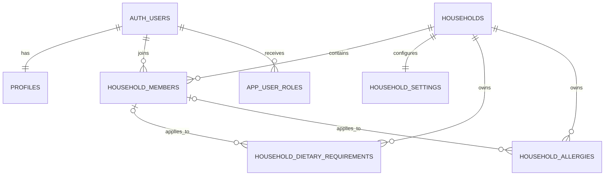

# Core household schema

Milestone 5A establishes the structural household model in the isolated `cooksmith` schema. It deliberately does not grant browser access or implement Row Level Security policies. Milestone 5B must add and verify default-deny RLS before these tables are deployed to a shared environment.

## Relationships

`profiles` contains global user presentation data and is independent of household membership. `household_members` is the many-to-many boundary between users and households, so one user can belong to more than one household. Global application roles are separate from household owner and member roles.

## Tables

- `profiles`: display name, timezone and locale for an Auth user.
- `households`: tenant identity, lifecycle state and audit attribution.
- `household_members`: one membership per user and household with owner/member and active/inactive state.
- `app_user_roles`: explicit global `admin`, `content_editor` or `support` grants. Email addresses never confer roles.
- `household_settings`: one constrained planning preference record per household.
- `household_dietary_requirements`: explicit household-wide or member-scoped hard/soft dietary constraints.
- `household_allergies`: explicit household-wide or member-scoped allergy records. Allergies are always treated as hard constraints and are never inferred.

## Integrity rules

- Lifecycle status and timestamp pairs must agree for households and memberships.
- A user has at most one membership row in a household.
- Member-scoped dietary requirements and allergies use composite foreign keys, preventing a membership from another household being referenced.
- Normalised dietary and allergy names are generated by PostgreSQL. Duplicate active scope/name combinations are rejected without silently merging user data.
- Servings, cooking-time limits, prep day, text lengths and locale format are constrained in the database and mirrored in Zod input schemas.
- Application-role self-grants are rejected at the schema layer. Authorised grants and complete escalation prevention belong to Milestone 5B.

## Timestamps and indexes

`cooksmith.set_updated_at()` is a security-invoker trigger function with an empty `search_path`. Every mutable Milestone 5A table uses it. Foreign-key and frequent membership, lifecycle and role lookup paths have deliberate indexes. PostgreSQL primary-key and unique constraints supply their own indexes and are not duplicated.

## Types and validation

The Supabase CLI generates database row, insert, update, relationship and enum types at `src/infrastructure/database/generated/database.types.ts` using `npm run db:types`. The file is generated output and must not be edited as an application model.

Framework-independent application names and unions live in `src/domain/households/types.ts`. Input validation lives in `src/domain/households/validationSchemas.ts`. Future application services must map generated snake_case database rows to the camelCase domain models rather than exposing internal database fields directly to UI contracts.

## Synthetic fixtures

`supabase/seed.sql` contains deterministic, non-production fixtures:

- Household A with Owner A and Member A
- Household B with Owner B
- Unrelated User with no membership
- separate settings rows plus one explicit dietary requirement and allergy

The Auth identities have no email address, password or credential. Fixture UUIDs and timestamps are synthetic and stable to make isolation failures obvious in Milestones 5B and 5C.

## Applying and correcting the migration

Run the normal [database workflow](database-workflow.md). Before this migration reaches a shared environment it may be corrected and the local database reset. Once shared, do not edit it. Add a forward-fix migration using the repository migration discipline.

Do not apply this schema to the existing prototype database or a production database. No destructive rollback is supplied. If removal is required before shared deployment, reset the isolated local v2 database. After shared deployment, use an explicitly reviewed forward migration.

## Security boundary

Milestone 5B enables default-deny RLS, adds reusable authorisation helpers and grants only policy-protected access to authenticated users. See [Authorisation and row level security](authorisation-and-row-level-security.md) for the current policy matrix. The schema remains outside the local Data API exposure list until a later approved client-integration milestone.
